# Mobiliti Africa: The Grand Vision & Corporate Manifesto

> *"We are not building a ridesharing app. We are building the operating system for African movement."*

---

## 1. The Core Thesis
Africa’s economic expansion is fundamentally capped by the friction of its physical movement. The continent faces unique mobility bottlenecks: high logistics costs (up to 75% higher than in developed markets), unsafe passenger transit, lack of real-time telemetry, carbon-heavy vehicle fleets, and disjointed infrastructure.

At **Mobiliti Africa**, we believe that solving these challenges requires a unified approach. We cannot rely solely on software; nor can we import hardware and energy systems that were designed for Western or Asian contexts. We must design and build the complete stack—**hardware, software, logistics networks, and clean energy systems**—tailored specifically to the realities of the African continent.

`soole.ng` (our ride-sharing and fleet logistics product) represents the first consumer and enterprise software layer of this grand roadmap. In the long term, Mobiliti Africa is the parent engine powering multiple industrial verticals.

---

## 2. Sector Verticals: The "Everything Mobility" Roadmap

```mermaid
graph TD
    MA[Mobiliti Africa Parent Enterprise]
    
    %% Verticals
    MA --> V_PASS[1. Urban & Intercity Passenger Transit]
    MA --> V_LOG[2. Industrial Logistics & Freight]
    MA --> V_HW[3. IoT, Telematics & Embedded Systems]
    MA --> V_EV[4. Clean Tech & EV Ecosystems]
    MA --> V_ITS[5. Intelligent Infrastructure & Smart Cities]
    MA --> V_AIR_RAIL[6. Aviation, Rail & Drone Logistics]

    %% Products under Passenger
    V_PASS --> SOOLE[Soole Carpooling]
    V_PASS --> SMART_BUS[Mobiliti Transit: Smart Bus Networks]
    
    %% Products under Logistics
    V_LOG --> CARGO[Mobiliti Cargo: Freight Matching]
    V_LOG --> COLD[Cold-chain Telemetry]

    %% Products under Hardware
    V_HW --> TELE[GPS, OBD-II & CAN Telemetry]
    V_HW --> SLOCK[Smart Locks & RFID Toll Tags]

    %% Products under Clean Tech
    V_EV --> SWAP[Battery Swap Infrastructure]
    V_EV --> RETRO[EV Retrofitting Kits]

    %% Products under ITS
    V_ITS --> TOLL[Digital Automated Toll Systems]
    V_ITS --> SIG[Smart Traffic Light Sensors]

    %% Products under Air/Rail
    V_AIR_RAIL --> RAIL_TR[Railway Cargo Integrations]
    V_AIR_RAIL --> DRONE[Medical/Cargo Drone Networks]
```



---

### 🟢 1. Urban & Intercity Passenger Transit
Modernizing how hundreds of millions of Africans commute daily.
* **Soole.ng (Active/In Development):** Peer-to-peer intercity ridesharing, passenger-to-driver matching, and union/operator fleet management.
* **Mobiliti Transit:** Software systems for public bus networks (BRTs), paratransit operators (Danfos, Matatus), and shuttle services. This includes automated mobile ticketing, smart passenger queuing, and route capacity scheduling.
* **Micromobility Solutions:** Last-mile transport options including e-bikes and smart e-scooters customized to withstand challenging road conditions.

---

### 🚚 2. Industrial Logistics & Freight
Streamlining the flow of goods across country borders and ports.
* **Mobiliti Cargo:** An Uber-like matching platform for long-haul trucks, container carriers, and cargo vans.
* **Cold-Chain Assurance:** Telemetry systems for agricultural and medical cargo, ensuring temperature, humidity, and location are monitored continuously from farm/factory to consumer.
* **Intermodal Logistics Hubs:** Software managing warehouses, port clearances, and cargo handling centers, integrating seamlessly with railways and shipping lines.

---

### 📡 3. IoT, Telematics & Embedded Systems
Building the hardware intelligence that collects real-time physical telemetry.
* **Universal OBD-II Units:** Fleet diagnostics hardware that reads vehicle engine status, fuel consumption, carbon emissions, and driver aggression indices.
* **Asset & Cargo Security:** Heavy-duty smart padlocks, door sensors, and anti-tamper modules that report directly to the cloud via WebSockets/MQTT.
* **Offline Telemetry Mesh Networks:** Developing peer-to-peer hardware routing protocols where vehicles can relay telemetry to each other in remote areas with zero cell coverage, uploading the data once any vehicle reaches a cellular tower.

---

### ⚡ 4. Clean Tech & Electric Vehicle (EV) Transition
Accelerating Africa’s transition away from high-carbon, imported internal combustion engines (ICE).
* **ICE-to-EV Retrofitting:** Cost-effective modular kits to convert popular African commuter buses and delivery motorcycles from petrol/diesel to electric power.
* **Battery Swap Network (Mobiliti Swap):** Solar-powered battery swapping hubs for two-wheelers and three-wheelers, minimizing charge downtime for commercial riders.
* **Local Battery Assemblies:** Designing rugged Battery Management Systems (BMS) equipped with liquid cooling/advanced heat dissipation to withstand tropical climates.

---

### 🛣️ 5. Intelligent Infrastructure & Smart Cities
Interfacing with governments, road concessionaires, and municipalities.
* **Automated Toll Systems (Mobiliti Pass):** Passive RFID-based toll tags that automatically deduct toll fees from unified digital wallets without requiring vehicles to stop.
* **Smart Traffic Management:** Computer-vision-enabled camera grids and road sensors that optimize traffic signal intervals based on real-time vehicle flow, reducing congestion in major metropolises like Lagos, Nairobi, and Accra.
* **Infrastructure Quality Auditing:** Hardware cameras mounted on regular transit vehicles that automatically detect, geolocate, and log potholes and road hazards to share with government contractors.

---

### ✈️ 🚂 6. Aviation, Rail & Drone Logistics
Optimizing non-road transit corridors and pioneering three-dimensional logistics.
* **Rail Cargo Telemetry:** Integrating with national and private freight rail networks to provide cargo tracking, schedule prediction, and predictive railcar maintenance alerts.
* **Airport Operations Telemetry:** Ground support vehicle tracking and airport baggage logistics software to reduce turnaround times.
* **Last-Mile Drone Deliveries:** Specialized long-range drone cargo logistics for delivering life-saving medical supplies (blood, vaccines) and high-value commerce items to remote islands and underserved areas.

---

## 3. The Mobiliti Africa Flywheel

Our business verticals do not work in isolation. They form a self-reinforcing ecosystem:

```
[ Software Users (Soole) ] 
        │
        ▼ Generates data & cash flow
[ Telemetry & Mapping (DataHub) ]
        │
        ▼ Points out high-friction routes & infrastructure gaps
[ Infrastructure & Hardware Investments (Tolls, IoT, Trackers) ]
        │
        ▼ Enhances transit safety & drops cost
[ Clean Tech & EV Deployment (Retrofitting & Swap Stations) ]
        │
        ▼ Drives down operating costs for software & fleet users
```

---

## 4. Engineering & Design Principles
To build "Everything Mobility" successfully in Africa, all Mobiliti engineering teams adhere to three core rules:

1. **Offline & Low-Bandwidth First:** Software must run gracefully on low-end smartphones and across unstable 2G/3G networks. Database sync should be asynchronous and queue-based.
2. **Extreme Physical Ruggedness:** Our hardware must be designed to withstand high dust loads, intense humidity, extreme vibration from rough roads, and high thermal strain.
3. **Open Standards:** We believe in interoperability. Our tracking APIs, maps, and charging specs follow open-source, easily integrable guidelines so that third-party developers can build on top of our infrastructure.
