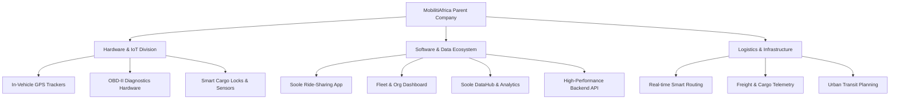

# MobilitiAfrica

> **Empowering Africa's mobility, logistics, and transit infrastructure through hardware engineering, telemetry, and advanced software solutions.**

> [!TIP]
> **Long-Term Corporate Vision:** Mobiliti Africa is an umbrella technology corporation building everything mobility for Africa. While `soole.ng` is one of our key software products, our grand roadmap encompasses EV transitions, smart cities, rail/aviation, and offline telematics. Read our full [Mobility Africa Vision & Corporate Manifesto](file:///c:/Users/Admin/Desktop/Soole.ng/MobilitiAfrica/Mobility_Africa_Vision.md) to explore the long-term vision.

---

## 1. Executive Summary
**MobilitiAfrica** is a high-tech mobility holding and engineering enterprise. We build the physical and digital infrastructure that powers the future of African transportation and logistics. 

By designing and manufacturing proprietary **IoT tracking hardware** and developing **enterprise software platforms**, MobilitiAfrica bridges the gap between hardware sensors and passenger/fleet management systems. Our goal is to create safer, more affordable, and highly efficient transport networks across urban and intercity corridors.

---

## 2. Core Pillars of MobilitiAfrica

### 📡 A. Hardware & IoT Engineering
Unlike typical software-only mobility companies, MobilitiAfrica designs and manufactures dedicated physical components to ensure unparalleled security, accuracy, and offline telemetry support.

| Hardware Product | Purpose | Integration Details |
| :--- | :--- | :--- |
| **Mobiliti GPS Tracker V1** | Precise vehicle location tracking even in low-connectivity areas. | Direct telemetry streaming to Soole Backend via cellular/GPRS. |
| **On-Board Diagnostics (OBD-II)** | Real-time vehicle health monitoring, fuel theft prevention, and speed monitoring. | Connects to vehicle CAN bus; broadcasts telemetry data to the DataHub. |
| **Smart Locks & Cargo Sensors** | Logistics monitoring for freight containers and intercity passenger luggage. | Bluetooth/NFC unlocking with real-time tamper alerts sent to the dashboard. |

> [!NOTE]
> All MobilitiAfrica hardware runs custom lightweight firmware written in C/C++ to optimize battery consumption and maximize bandwidth efficiency across remote regions.

---

### 💻 B. The Software Ecosystem (Soole Suite)
Our hardware feeds directly into our software stack, providing real-time intelligence to passengers, fleet owners, and operators. The centerpiece of our consumer and B2B software is the **Soole** product line.

#### 1. Soole Passenger App
* **Description:** A ride-sharing and carpooling platform connecting travelers heading in the same direction.
* **Key Features:**
  * Intercity and intracity trip matching.
  * In-app community chat and verification.
  * Real-time location tracking for safety sharing.
  * Panic buttons and hardware-linked distress signals.

#### 2. Soole Organizational Dashboard
* **Description:** The enterprise portal for commercial transit companies and transport unions.
* **Key Features:**
  * Vehicle and driver registry with KYC verification.
  * Fleet scheduling, dispatch management, and route assignment.
  * Live Map tracking powered by MobilitiAfrica hardware telemetry.
  * Automated financial reconciliation, ticketing, and payout systems.

#### 3. Soole DataHub
* **Description:** The analytic and visualization engine powering the ecosystem.
* **Key Features:**
  * Processing high-throughput telemetry from GPS and OBD-II hardware.
  * Heatmaps, traffic density analysis, and routing optimizations.
  * Data syndication to municipal authorities for infrastructure planning.

#### 4. High-Performance Backend & APIs
* **Description:** The unified API gateway and state machine.
* **Key Features:**
  * Real-time WebSocket connection hub for device telemetry.
  * Microservice architecture handling user auth, billing, matching, and telemetry.

---

### 🚚 C. Logistics & Transit Infrastructure
We leverage our combined hardware-software architecture to optimize heavy transport logistics and passenger logistics:
* **Asset Tracking:** Live tracking of cargo, trucks, and buses across major African transport corridors (e.g., Lagos-Ibadan Express, East-West corridors).
* **Predictive Dispatching:** Algorithms that dispatch drivers based on historical passenger demand, weather, traffic, and vehicle health metrics.
* **Public-Private Infrastructure:** Collaborating with municipal authorities to digitize ticketing, terminal scheduling, and toll integrations.

---

## 3. Technology Stack & Architecture

MobilitiAfrica utilizes modern, battle-tested technologies to handle scale, reliability, and precision:

* **Frontend & Web Applications:**
  * Frameworks: [Next.js](https://nextjs.org/) (used by [soole-official-website](file:///c:/Users/Admin/Desktop/Soole.ng/soole-official-website)), React, TypeScript.
  * Styling: Tailwind CSS, custom design systems.
  * State & UI: Framer Motion for premium micro-animations.

* **Mobile Applications:**
  * React Native / Flutter for cross-platform passenger and driver applications.

* **Backend & Telemetry Processing:**
  * Core APIs: Node.js (TypeScript) / Python.
  * Real-time Data: WebSockets, MQTT brokers for hardware communication.
  * Database: PostgreSQL for transactional data, TimescaleDB / Redis for telemetry and caching.

* **Firmware & Hardware Systems:**
  * ESP32 and STM32 microcontroller architectures.
  * Firmware: Embedded C/C++ with FreeRTOS.

---

## 4. Why MobilitiAfrica?

> [!TIP]
> **Safety First:** Combining physical GPS trackers, OBD diagnostics, and software verification creates a trusted network.
>
> **Efficiency:** Reducing deadhead miles (empty trips) for commercial vehicles and carpoolers improves profit margins and reduces carbon emissions.
>
> **Data-Driven:** Advanced telemetry gives fleet operators insights into fuel consumption, driver behavior, and route efficiency.

---

## 5. Repository Directories Reference

Here is a map of the MobilitiAfrica / Soole codebase:
* [MobilitiAfrica (Parent Landing Page)](file:///c:/Users/Admin/Desktop/Soole.ng/MobilitiAfrica): Corporate landing page and overall repository entry point.
* [soole-official-website](file:///c:/Users/Admin/Desktop/Soole.ng/soole-official-website): The official landing page and portal for the Soole app.
* [soole-dashboard](file:///c:/Users/Admin/Desktop/Soole.ng/soole-dashboard): B2B fleet management software dashboard.
* [soole-mobile-app](file:///c:/Users/Admin/Desktop/Soole.ng/soole-mobile-app): Passenger and driver React Native / Flutter apps.
* [soole-backend](file:///c:/Users/Admin/Desktop/Soole.ng/soole-backend): Core API backend services.
* [soole-datahub](file:///c:/Users/Admin/Desktop/Soole.ng/soole-datahub): Analytics, routing engines, and telemetry processor.
